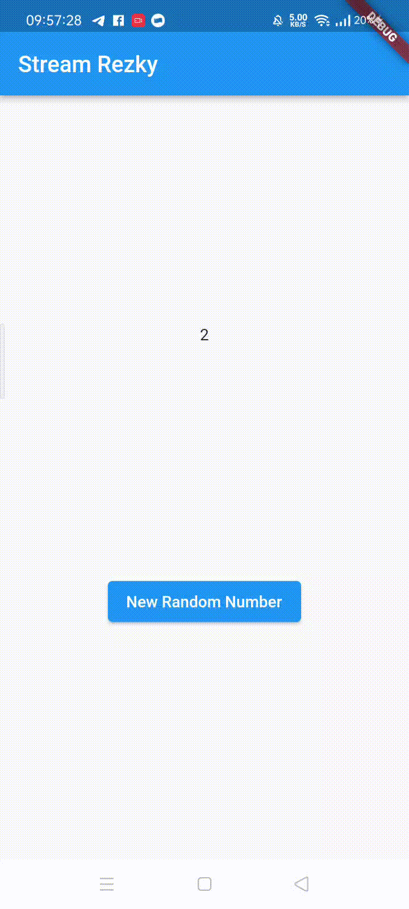
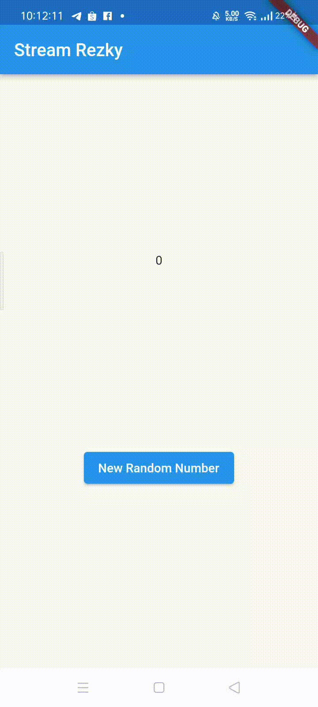
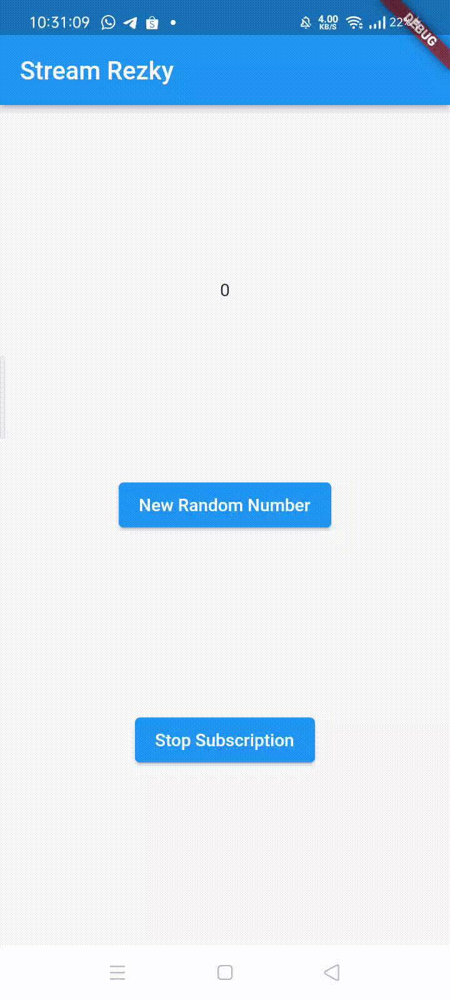
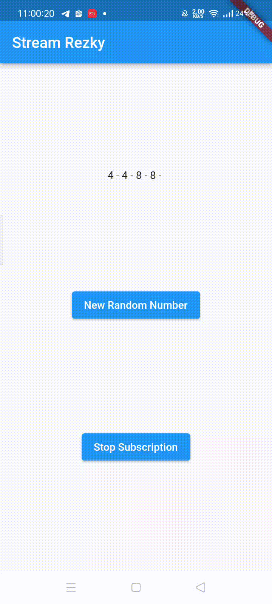
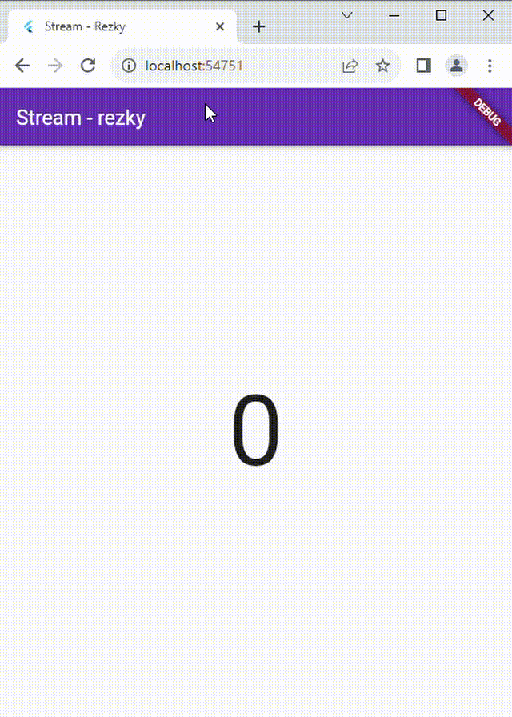

**Bagus Rezky Adhyaksa**

**3H/07**

**2141720210**

---

# **Lanjutan State Management dengan Streams**

## **Praktikum 1: Dart Streams**

**Soal 1:** Tambahkan nama panggilan Anda pada title app sebagai identitas hasil pekerjaan Anda. Gantilah warna tema aplikasi sesuai kesukaan Anda.
```
class MyApp extends StatelessWidget {
  const MyApp({super.key});

  // This widget is the root of your application.
  @override
  Widget build(BuildContext context) {
    return MaterialApp(
      title: 'Stream Rezky',
      theme: ThemeData(
        primarySwatch: Colors.indigo
      ),
      home: const StreamHomePage(),
    );
  }
}
```
**Soal 2:** Tambahkan 5 warna lainnya sesuai keinginan Anda pada variabel colors tersebut.

```
import 'package:flutter/material.dart';

class ColorStream {
  final List<Color> colors = [
    Colors.blueGrey,
    Colors.amber,
    Colors.deepPurple,
    Colors.lightBlue,
    Colors.teal,
    Colors.black,
    Colors.lime,
    Colors.pink,
    Colors.grey,
    Colors.brown,
  ];
}
```

**Soal 3:** Jelaskan fungsi keyword yield* pada kode tersebut!
Apa maksud isi perintah kode tersebut?
```
Stream<Color> getColors() async* {
    yield* Stream.periodic(const Duration(seconds: 1), (int t) {
      int index = t % colors.length;
      return colors[index];
    });
  }

```
Dalam potongan kode tersebut, digunakan kata kunci `yield*` dalam Dart untuk menciptakan sebuah stream yang secara berulang menghasilkan nilai setiap detik. Fungsi generator memanfaatkan `Stream.periodic` untuk membentuk stream dengan interval waktu satu detik, dan setiap kali fungsi tersebut dipanggil, menghasilkan nilai dari array colors berdasarkan indeks yang dihitung dengan memperhatikan waktu atau iterasi dari stream. Akibatnya, stream tersebut secara berurutan mengeluarkan warna-warna dari array colors setiap detiknya.

**Soal 4:** Capture hasil praktikum Anda berupa GIF


**Soal 5:** Jelaskan perbedaan menggunakan listen dan await for (langkah 9) !


Perbedaan antara memanfaatkan await for dan listen terletak pada sifat blocking dan non-blocking dalam penanganan stream di Dart. Dengan menggunakan await for, eksekusi metodenya menjadi blocking, di mana kode akan menunggu hingga nilai berikutnya tersedia dalam stream sebelum melanjutkan proses, sedangkan listen bersifat non-blocking. Sifat non-blocking dari listen memungkinkan eksekusi kode untuk terus berjalan tanpa menunggu nilai stream, dan setiap kali nilai baru tersedia, fungsi yang diberikan sebagai argumen akan dipanggil.

## **Praktikum 2: Streams Controllers dan Sinks**

**Soal 6:** Jelaskan maksud kode langkah 8 dan 10 tersebut!
```
  @override
  void initState(){
    numberStream = NumberStream();
    numberStreamController = numberStream.controller;
    Stream stream = numberStreamController.stream;
    stream.listen((event){
      setState((){
        lastNumber = event;
      });
    });
    super.initState();
  }

  void addRandomNumber(){
    Random random = Random();
    int myNum = random.nextInt(10);
    numberStream.addNumbertoSink(myNum);
  }
```
Dalam tahap awal pembuatan widget, objek NumberStream dan StreamController dibuat, dan pendengar (listener) ditambahkan pada aliran data dari StreamController. Ketika nilai dalam aliran data mengalami perubahan, fungsi setState dipanggil untuk mengupdate nilai lastNumber. Perubahan ini kemudian akan mempengaruhi tampilan widget. Fungsi addRandomNumber bertanggung jawab untuk menciptakan angka acak dan mengirimkannya ke dalam aliran data melalui numberStream.addNumberToSink(myNum).



**Soal 7:** Jelaskan maksud kode langkah 13 sampai 15 

Dalam Langkah 13, fungsi addError ditambahkan ke dalam file "stream.dart", memungkinkan penambahan error ke dalam sink dari StreamController. Langkah 14 memperluas implementasi pendengar aliran data di file "main.dart" dengan menambahkan fungsi onError. Jika terjadi error dalam aliran data, nilai lastNumber akan diperbarui menjadi -1. Langkah 15 mengubah implementasi fungsi addRandomNumber di file "main.dart" dengan menonaktifkan pembuatan angka acak dan menggantinya dengan pemanggilan fungsi addError. Ini memberikan kemampuan untuk mensimulasikan dan menangani situasi error dalam aliran data dengan mengubah nilai lastNumber menjadi -1.

## **Praktikum 3: Injeksi Data ke Streams**

**Soal 8:** Jelaskan maksud kode langkah 1-3 tersebut!

Langkah 1 melibatkan penambahan variabel transformer ke dalam kelas _StreamHomePageState di file "main.dart". Pada Langkah 2, dibuat sebuah StreamTransformer dalam metode initState yang mengatur transformasi data dalam aliran. Transformasi ini mengalikan nilai input dengan 10 dan menangani error dengan mengirim nilai -1 ke dalam aliran. Pada Langkah 3, metode transform diterapkan pada objek stream, memproses aliran data sesuai dengan transformasi yang telah ditentukan oleh transformer. Hasil transformasi diteruskan ke pendengar (listener) aliran data, di mana nilai tersebut digunakan untuk memperbarui lastNumber dalam setState. 



## **Praktikum 4: Subscribe ke Strean Events**

**Soal 9:** Jelaskan maksud kode langkah 2, 6 dan 8 tersebut!


Langkah 2 melibatkan modifikasi pada metode initState dalam Flutter. Setelah mendapatkan aliran data dari numberStreamController, sebuah subscription dibuat untuk mendengarkan perubahan pada aliran tersebut. Jika terjadi perubahan, nilai lastNumber diperbarui; sementara jika terjadi error, nilai lastNumber diatur menjadi -1. Pada langkah ini juga, pesan 'OnDone was called' akan dicetak ketika aliran data selesai. 

Langkah 6, yang umumnya terdapat dalam metode dispose, menggunakan subscription.cancel() untuk memastikan bahwa langganan pada aliran data dihentikan ketika widget tidak lagi digunakan. 

Langkah 8 mengubah metode addRandomNumber, menambahkan pemeriksaan untuk memastikan bahwa angka acak hanya ditambahkan ke aliran data jika numberStreamController belum ditutup. Jika sudah ditutup, nilai lastNumber diatur menjadi -1.



## **Praktikum 5: Multiple Stream Subscriptions**


**Soal 10:** Jelaskan mengapa error itu bisa terjadi ?


Error "Bad state: Stream has already been listened to" terjadi karena pada Langkah 2, dua objek StreamSubscription (subscription dan subscription2) mencoba untuk mendengarkan aliran data (stream) yang sama. Setiap objek StreamSubscription dapat terhubung ke suatu aliran data hanya satu kali pada satu waktu.

Untuk mengatasi masalah ini, pastikan bahwa suatu aliran data hanya didengarkan oleh satu objek StreamSubscription pada satu waktu. Jika sudah ada objek StreamSubscription yang mendengarkan aliran tersebut, pastikan untuk membatalkan langganan (cancel) sebelum mencoba untuk membuat langganan baru. Anda dapat menggunakan metode cancel() pada objek StreamSubscription untuk menghentikan langganan dan melepaskan sumber daya yang terkait

**Soal 11:** Jelaskan mengapa hal itu bisa terjadi ?


Pada Langkah 4, stream data diubah menjadi jenis broadcast dengan menambahkan .asBroadcastStream(). Hal ini memungkinkan lebih dari satu StreamSubscription mendengarkan aliran data yang sama. Kemudian, pada Langkah 2, dua objek StreamSubscription (subscription dan subscription2) dibuat untuk mendengarkan aliran data yang sama.

Saat tombol 'New Random Number' ditekan, nilai acak ditambahkan ke dalam aliran data. Karena aliran data adalah tipe broadcast, kedua StreamSubscription menerima nilai tersebut, menyebabkan teks angka pada tampilan bertambah dua kali.

Ini adalah perilaku yang diharapkan ketika menggunakan stream broadcast. Jika Anda ingin menghindari tampilan bertambah dua kali, Anda dapat mempertimbangkan untuk menggunakan satu objek StreamSubscription dan kemudian berbagi nilai tersebut di antara komponen UI yang memerlukan pembaruan. Jika memang diperlukan dua objek StreamSubscription, pastikan untuk mengelola pembaruan UI dengan bijak untuk menghindari efek ganda.




## **Praktikum 6: StreamBuilder**

**Soal 12:**


Dalam Langkah 3, kode di file "stream.dart" mendefinisikan kelas NumberStream yang memiliki metode getNumbers(). Metode ini menggunakan Stream.periodic untuk membuat aliran data yang menghasilkan nilai acak setiap detik.

Pada Langkah 7, dalam file "main.dart," menggunakan StreamBuilder untuk membangun antarmuka pengguna yang merespons perubahan pada aliran data numberStream. Jika terjadi error, dicetak pesan 'Error!'. Jika ada data pada snapshot, teks dengan nilai data tersebut ditampilkan di tengah layar dengan ukuran font 96. Jika tidak ada data, widget tetap mempertahankan tata letak tanpa konten yang terlihat.

Ini adalah pendekatan yang umum digunakan untuk menggabungkan aliran data dengan antarmuka pengguna di Flutter. StreamBuilder secara otomatis membangun kembali widget ketika ada perubahan dalam aliran data yang dipantau. Dengan demikian, antarmuka pengguna akan secara dinamis berubah sesuai dengan nilai yang diterima dari aliran data.



## **Praktikum 7: BLoC Pattern**

**Soal 13:** Jelaskan maksud praktikum ini ! Dimanakah letak konsep pola BLoC-nya ? 

Praktikum ini memperkenalkan konsep BLoC (Business Logic Component) pada Flutter dengan menerapkan pola arsitektur BLoC. Konsep BLoC terletak pada kelas RandomNUmberBloc yang bertindak sebagai komponen logika bisnis. Dalam implementasinya, dua StreamController digunakan untuk mengelola input dan output, yaitu _generateRandomController sebagai sink untuk menerima input dan _randomNumberController sebagai stream untuk mengirimkan output. Ketika tombol ditekan, generateRandom menerima input, dan melalui proses logika bisnis (pembuatan angka acak), hasilnya dikirimkan ke randomNumber untuk kemudian diteruskan ke antarmuka pengguna menggunakan StreamBuilder.


