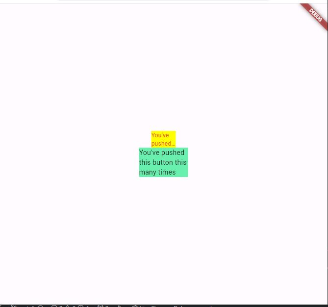

# week_10

1. Selesaikan Praktikum tersebut, lalu dokumentasikan dan push ke repository berupa screenshot hasil pekerjaan beserta penjelasannya di file README.md!
   
2. Jelaskan maksud dari langkah 2 pada praktikum tersebut!

   Pustaka Flutter auto_size_text adalah pustaka yang memungkinkan teks untuk menyesuaikan ukurannya secara otomatis sesuai dengan ukuran kontainer yang diberikan. Ini sangat berguna ketika ingin menghindari pemangkasan teks yang terlalu panjang atau terlalu kecil dalam widget.

3. Jelaskan maksud dari langkah 5 pada praktikum tersebut!

   - final String text; adalah deklarasi variabel text yang bertipe String dan diberi kata kunci final. Ini berarti variabel text akan bersifat tidak dapat diubah setelah nilainya ditetapkan. Variabel ini digunakan untuk menerima teks yang akan ditampilkan oleh widget.
   - ({Key? key, required this.text}) adalah parameter konstruktor yang digunakan untuk menginisialisasi objek dari kelas RedTextWidget. Parameter key bertipe Key? dan bersifat opsional karena diawali dengan kurung kurawal {}. Ini adalah cara yang umum digunakan untuk menerima parameter opsional yang akan digunakan untuk mengidentifikasi widget secara unik.
   - Parameter required this.text adalah parameter yang wajib (required) dan digunakan untuk menginisialisasi variabel text yang dideklarasikan sebelumnya.

4. Pada langkah 6 terdapat dua widget yang ditambahkan, jelaskan fungsi dan perbedaannya!

- Penyesuaian Otomatis Ukuran Teks Dengan "auto_size_text": Ketika menggunakan "auto_size_text," teks akan menyesuaikan ukurannya secara otomatis dengan ruang yang tersedia. Ini berarti teks akan secara dinamis menyesuaikan ukuran fontnya agar sesuai dengan lebar atau tinggi kontainer yang ditetapkan. Ini membantu menghindari pemangkasan teks atau tampilan teks yang terlalu kecil.

- Tanpa "auto_size_text": Tanpa plugin ini, perlu mengelola ukuran teks secara manual. Ini berarti harus memeriksa lebar atau tinggi kontainer dan mengatur ukuran fontnya sesuai. Ini bisa menjadi lebih rumit dan memakan waktu jika memiliki berbagai kontainer dengan ukuran yang berbeda.

* Penanganan Pemangkasan Teks:

- Dengan "auto_size_text": Plugin ini memungkinkan untuk mengontrol bagaimana teks akan ditampilkan saat melebihi batas kontainer yang tersedia. dapat mengatur parameter seperti maxLines dan overflow untuk mengatur perilaku teks yang terlalu panjang.

- Tanpa "auto_size_text": Tanpa plugin ini, jika teks melebihi batas kontainer, itu akan dipangkas atau dibatasi sesuai dengan konfigurasi yang tentukan secara manual. harus mengelola pemangkasan dan pemotongan teks dengan cara yang lebih sulit.

* Kemudahan Penggunaan:

- Dengan "auto_size_text": Plugin ini menyediakan widget khusus (AutoSizeText) yang sangat mudah digunakan. hanya perlu memberikan teks, dan plugin akan mengurus sisanya untuk.

- Tanpa "auto_size_text": Tanpa plugin ini, perlu menulis lebih banyak kode sendiri untuk menghitung dan mengatur ukuran font teks sesuai dengan lebar atau tinggi kontainer. Ini bisa menjadi lebih kompleks dan memakan waktu.

5. Jelaskan maksud dari tiap parameter yang ada di dalam plugin auto_size_text berdasarkan tautan pada dokumentasi ini !

```dart
Usage (Penggunaan):

maxLines: Menentukan jumlah maksimum baris yang ingin ditampilkan untuk teks. Jika teks melebihi jumlah baris yang ditentukan, perilaku pemotongan atau penggantian dapat dikendalikan dengan parameter berikut.

minFontSize & maxFontSize: Mengatur rentang ukuran font minimum dan maksimum yang dapat digunakan oleh teks. Ini memungkinkan teks untuk menyesuaikan ukurannya dalam rentang ini.

group: Mengelompokkan beberapa widget AutoSizeText bersama-sama sehingga mereka memiliki ukuran font yang seragam dalam kelompok yang sama.

stepGranularity: Menentukan sejauh mana ukuran font dapat diubah dengan setiap perubahan ukuran.

presetFontSizes: Menentukan daftar ukuran font yang dapat digunakan oleh AutoSizeText. Ini memungkinkan untuk membatasi ukuran font hanya pada ukuran tertentu.

overflowReplacement: Menggantikan teks dengan widget lain saat teks melebihi ruang yang tersedia.

Rich Text (Teks Kaya):

Plugin ini juga mendukung teks kaya dengan parameter tambahan seperti textOverflow, textSpan, dan style yang memungkinkan untuk mengontrol tampilan teks yang lebih kompleks.

Parameters (Parameter):

Pada bagian ini, dapat menemukan penjelasan lebih lanjut tentang parameter yang tersedia.

Performance (Kinerja):

Plugin ini mencakup informasi tentang kinerja dan cara mengoptimalkan penggunaan "auto_size_text" dalam proyek.

Troubleshooting (Pemecahan Masalah):

Bagian ini berisi informasi tentang pemecahan masalah yang umumnya dihadapi saat menggunakan plugin ini, termasuk masalah seperti teks yang tidak sesuai atau tidak tampil dengan benar.

Missing bounds (Batas yang Hilang):

Ini menjelaskan bagaimana dapat menentukan batas atau kontainer yang harus digunakan untuk mengukur dan menyesuaikan teks.

MinFontSize too large (MinFontSize terlalu besar):

Ini mengatasi masalah ketika nilai minFontSize terlalu besar sehingga teks tidak dapat menyesuaikan ukurannya dengan baik.
```
