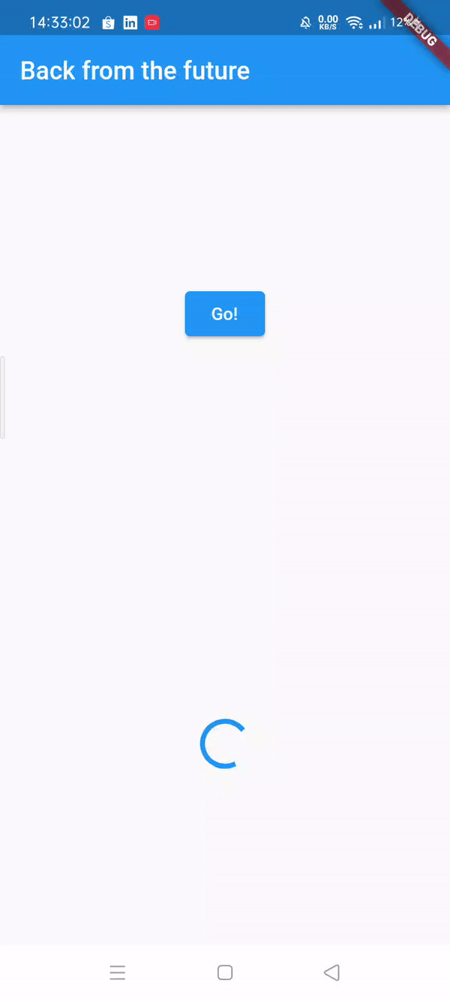
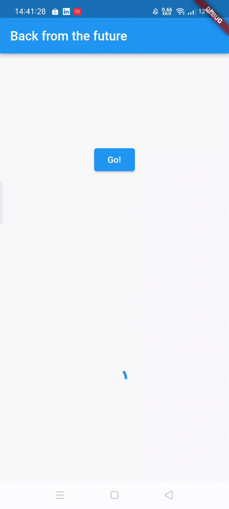

# Praktikum 1: Mengunduh Data dari Web Service (API)

Selesaikan langkah-langkah praktikum berikut ini menggunakan editor Visual Studio Code (VS Code) atau Android Studio atau code editor lain kesukaan Anda. Jawablah di laporan praktikum Anda pada setiap soal yang ada di beberapa langkah praktikum ini.

Perhatian: Diasumsikan Anda telah berhasil melakukan setup environment Flutter SDK, VS Code, Flutter Plugin, dan Android SDK pada pertemuan pertama.

### Langkah 1: Buat Project Baru
Buatlah sebuah project flutter baru dengan nama books di folder src week-12 repository GitHub Anda.

Kemudian Tambahkan dependensi http dengan mengetik perintah berikut di terminal.

flutter pub add http

Langkah 2: Cek file pubspec.yaml
Jika berhasil install plugin, pastikan plugin http telah ada di file pubspec ini seperti berikut.

```dart
dependencies:
  flutter:
    sdk: flutter
  http: ^1.1.0
  ```


### Soal 1
Tambahkan nama panggilan Anda pada title app sebagai identitas hasil pekerjaan Anda.

Jawab : 
```dart
 Widget build(BuildContext context) {
    return MaterialApp(
      title: 'Rezky',
      theme: ThemeData(
          primarySwatch: Colors.blue,
          visualDensity: VisualDensity.adaptivePlatformDensity),
      home: const FuturePage(),
    );
  }
```

### Soal 2
Carilah judul buku favorit Anda di Google Books, lalu ganti ID buku pada variabel path di kode tersebut. Caranya ambil di URL browser Anda seperti gambar berikut ini.


Kemudian cobalah akses di browser URI tersebut dengan lengkap seperti ini. Jika menampilkan data JSON, maka Anda telah berhasil. Lakukan capture milik Anda dan tulis di README pada laporan praktikum. Lalu lakukan commit dengan pesan "W12: Soal 2".


### Soal 3
- Jelaskan maksud kode langkah 5 tersebut terkait `substring` dan `catchError`!

Jawab : 
>substring() adalah metode untuk mengambil substring dari string. Substring adalah bagian dari string yang dimulai dari indeks tertentu dan berakhir pada indeks tertentu. Metode substring() menerima dua parameter, yaitu indeks awal dan indeks akhir. Indeks awal adalah indeks karakter pertama yang ingin diambil, dan indeks akhir adalah indeks karakter terakhir yang ingin diambil.
>catchError() adalah metode untuk menangani kesalahan. Metode catchError() menerima satu parameter, yaitu fungsi yang akan dijalankan jika terjadi kesalahan. Fungsi tersebut akan menerima objek kesalahan sebagai parameter.
>Kode di atas menggunakan substring() untuk mengambil 450 karakter pertama dari respons API. Jika terjadi kesalahan saat mengambil respons API, maka kode tersebut akan menggunakan catchError() untuk menampilkan pesan kesalahan "An error occurred".
- Capture hasil praktikum Anda berupa GIF dan lampirkan di README. Lalu lakukan commit dengan pesan "W12: Soal 3".




### Soal 4
- Jelaskan maksud kode langkah 1 dan 2 tersebut!

>Langkah 1
>Kode di atas adalah kode Dart yang terdiri dari tiga fungsi asynchronous, yaitu returnOneAsync(), returnTwoAsync(), dan returnThreeAsync(). Ketiga fungsi ini mengembalikan nilai int dan menggunakan Future.delayed() untuk menunda eksekusi selama 3 detik.
>Berikut adalah penjelasan masing-masing fungsi:
>- returnOneAsync()
>Fungsi ini mengembalikan nilai 1 setelah 3 detik.
>- returnTwoAsync()
>Fungsi ini mengembalikan nilai 2 setelah 3 detik.
>- returnThreeAsync()
>Fungsi ini mengembalikan nilai 3 setelah 3 detik.

>Langkah 2
>Kode di atas adalah sebuah fungsi asynchronous bernama count() yang digunakan untuk menghitung jumlah dari tiga fungsi asynchronous lainnya, yaitu returnOneAsync(), returnTwoAsync(), dan returnThreeAsync(). Fungsi count() ini mengembalikan Future, yang berarti bahwa eksekusinya tidak akan memblokir kode lainnya.

- Capture hasil praktikum Anda berupa GIF dan lampirkan di README. Lalu lakukan commit dengan pesan "W12: Soal 4".



### Soal 5
- Jelaskan maksud kode langkah 2 tersebut!
Jawab : 
>Pada langkah 2, kita menambahkan variabel completer dan method getNumber() dan calculate() di class _FuturePageState.
>1. Variabel completer
>Variabel completer adalah variabel late dari tipe Completer<int>. Variabel ini digunakan untuk menyimpan hasil dari perhitungan angka 42.
>2. Method getNumber()
>Method getNumber() mengembalikan nilai dari variabel completer. Method ini memiliki dua langkah:
>a. Inisialisasi variabel completer dengan nilai baru.
>b. Memanggil method calculate() untuk menghitung angka 42.
>3. Method calculate()
>Method calculate() menggunakan Future.delayed() untuk menunggu 5 detik sebelum menyelesaikan perhitungan angka 42. Setelah 5 detik, method ini akan memanggil method completer.complete() untuk menyelesaikan perhitungan dan mengembalikan nilai 42 ke variabel completer

<br>
- Capture hasil praktikum Anda berupa GIF dan lampirkan di README. Lalu lakukan commit dengan pesan "W12: Soal 5".


### Soal 6
- Jelaskan maksud perbedaan kode langkah 2 dengan langkah 5-6 tersebut!

>Langkah 5
>Pada langkah 5, kita mengganti isi dari method calculate(). Method calculate() sebelumnya menggunakan await Future.delayed(const Duration(seconds: 5)); untuk menunggu 5 detik sebelum menyelesaikan perhitungan angka 42. Namun, method ini tidak menangani kesalahan yang mungkin terjadi saat menunggu 5 detik.
>Kode ini menggunakan try/catch untuk menangani kesalahan yang mungkin terjadi saat menunggu 5 detik. Jika tidak terjadi kesalahan, maka method ini akan memanggil method completer.complete() untuk menyelesaikan perhitungan dan mengembalikan nilai 42 ke variabel completer. Jika terjadi kesalahan, maka method ini akan memanggil method completer.completeError() untuk menyelesaikan perhitungan dan mengembalikan nilai {} ke variabel completer.

>Langkah 6
>Pada langkah 6, kita mengganti kode di method onPressed(). Method onPressed() sebelumnya menggunakan then() untuk menangani hasil dari method getNumber(). Namun, method ini tidak menangani kesalahan yang mungkin terjadi saat memanggil method getNumber().
>Kode ini menggunakan then() dan catchError() untuk menangani hasil dari method getNumber(). Jika tidak terjadi kesalahan, maka method ini akan memanggil method setState() untuk memperbarui state dari widget. Jika terjadi kesalahan, maka method ini akan memanggil method setState() untuk memperbarui state dari widget dan menampilkan pesan kesalahan.
- Capture hasil praktikum Anda berupa GIF dan lampirkan di README. Lalu lakukan commit dengan pesan "W12: Soal 6".


### Soal 7
- Capture hasil praktikum Anda berupa GIF dan lampirkan di README. Lalu lakukan commit dengan pesan "W12: Soal 7"


### Soal 8
- Jelaskan maksud perbedaan kode langkah 1 dan 4!
Jawab : 
>Perbedaan kode langkah 1 dan kode langkah 4 adalah pada penggunaan variabel futureGroup. Pada langkah 1, variabel futureGroup digunakan untuk menampung FutureGroup<int>. FutureGroup adalah sebuah objek yang dapat digunakan untuk mengelompokkan beberapa Future bersama-sama. Sedangkan pada langkah 4, variabel futureGroup diganti dengan Future.wait<int>(). Future.wait<int>() adalah sebuah fungsi yang dapat digunakan untuk menunggu beberapa Future selesai dijalankan.

### Soal 9
- Capture hasil praktikum Anda berupa GIF dan lampirkan di README. Lalu lakukan commit dengan pesan "W12: Soal 9".


### Soal 10
- Panggil method handleError() tersebut di ElevatedButton, lalu run. Apa hasilnya? Jelaskan perbedaan kode langkah 1 dan 4!

>Perbedaan kode langkah 1 dan kode langkah 4 adalah pada penanganan error. Pada langkah 1, method returnError() tidak menangani error yang terjadi. Jika error terjadi, maka method tersebut akan berhenti dan tidak mengembalikan nilai apa pun.

>Sedangkan pada langkah 4, method handleError() menangani error yang terjadi dengan menggunakan try-catch-finally. Pada try block, method handleError() mencoba untuk menjalankan method returnError(). Jika error terjadi, maka try block akan berhenti dan error akan ditangkap oleh catch block. Pada catch block, method handleError() akan menampilkan error ke layar menggunakan print(). Finally block akan selalu dijalankan, terlepas dari apakah ada error yang terjadi atau tidak.

### Soal 11
- Tambahkan nama panggilan Anda pada tiap properti title sebagai identitas pekerjaan Anda.

Jawab : 
```dart
appBar: AppBar(title: const Text('Current Location Rezky')),
```

### Soal 12
- Jika Anda tidak melihat animasi loading tampil, kemungkinan itu berjalan sangat cepat. Tambahkan delay pada method getPosition() dengan kode await Future.delayed(const Duration(seconds: 3));

Jawab : 
```dart
Future<Position> getPosition() async {
    await Geolocator.requestPermission();
    await Geolocator.isLocationServiceEnabled();
    await Future.delayed(const Duration(seconds: 3));
    Position? position = await Geolocator.getCurrentPosition();
    return position;
  }
```
- Apakah Anda mendapatkan koordinat GPS ketika run di browser? Mengapa demikian?

Jawab :
>Karena package geolocator juga support di browser, sehingga koordinat GPS juga bisa didapatkan pada browser, beserta izinnya.

- Capture hasil praktikum Anda berupa GIF dan lampirkan di README. Lalu lakukan commit dengan pesan "W12: Soal 12".


### Soal 13
- Apakah ada perbedaan UI dengan praktikum sebelumnya? Mengapa demikian?

Jawab : 
>Kedua praktikum menampilkan koordinat Geolokasi dengan layout yang sama. Hal ini terjadi karena keduanya mengambil lokasi pengguna secara langsung saat aplikasi dimulai.

>Untuk pembaruan UI, pada kasus pertama, setState digunakan untuk memperbarui variabel state myPosition. Pada kasus kedua, FutureBuilder digunakan untuk mengelola pembaruan UI secara otomatis. Namun pada akhirnya, hasil tampilan UI terlihat sama karena keduanya memiliki penundaan yang sama, yakni 3 detik.

- Capture hasil praktikum Anda berupa GIF dan lampirkan di README. Lalu lakukan commit dengan pesan "W12: Soal 13".


- Seperti yang Anda lihat, menggunakan FutureBuilder lebih efisien, clean, dan reactive dengan Future bersama UI.


### Soal 14
- Apakah ada perbedaan UI dengan langkah sebelumnya? Mengapa demikian?

Jawab : 
> Langkah ini tidak mengubah tampilan UI. Hal ini karena langkah ini hanya menambahkan fungsi handleError() yang akan dijalankan jika terjadi kesalahan. Namun, pada langkah ini tidak ada kesalahan yang terjadi selama pemrosesan data lokasi. Oleh karena itu, pesan kesalahan "Something terrible happened!" tidak akan ditampilkan.

- Capture hasil praktikum Anda berupa GIF dan lampirkan di README. Lalu lakukan commit dengan pesan "W12: Soal 14".

Jawab : 


### Soal 15
- Tambahkan nama panggilan Anda pada tiap properti title sebagai identitas pekerjaan Anda.

```dart
appBar: AppBar(
        title: const Text('Navigation First Screen Rezky'),
      ),
```

- Silakan ganti dengan warna tema favorit Anda.

### Soal 16
- Cobalah klik setiap button, apa yang terjadi ? Mengapa demikian ?

Jawab : 
>Ketika tombol ditekan, warnanya akan berubah sesuai dengan warna yang telah ditetapkan pada widget ElevatedButton() di class navigation_second.dart. Hal ini dikarenakan setiap tombol memiliki fungsi Navigation.pop() yang memiliki parameter berupa context dan warna yang telah ditetapkan. Oleh karena itu, setiap tombol yang ditekan akan menampilkan warna yang berbeda-beda sesuai dengan nilai variabel warna.

- Gantilah 3 warna pada langkah 5 dengan warna favorit Anda!
- Capture hasil praktikum Anda berupa GIF dan lampirkan di README. Lalu lakukan commit dengan pesan "W12: Soal 16".


### Soal 17
- Cobalah klik setiap button, apa yang terjadi ? Mengapa demikian ?

Jawab : 
> Ketika Anda menekan tombol "Change Color" dan memilih warna pada dialog, layar akan mengalami perubahan pada warna latar belakang. Ini disebabkan oleh pembaruan nilai warna dalam fungsi _showColorDialog, diikuti dengan pembaruan widget menggunakan setState. Tindakan ini akan memicu pembangunan ulang widget dan mencerminkan perubahan warna yang telah dipilih pada layar.

- Gantilah 3 warna pada langkah 3 dengan warna favorit Anda!
- Capture hasil praktikum Anda berupa GIF dan lampirkan di README. Lalu lakukan commit dengan pesan "W12: Soal 17".


