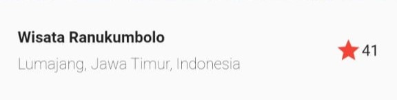
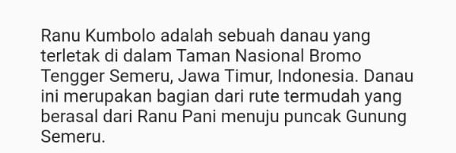
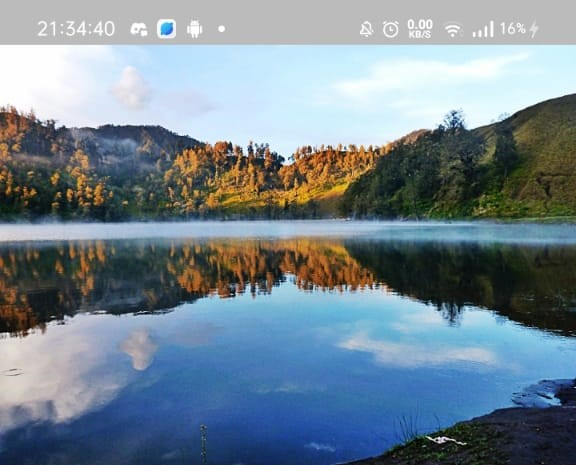
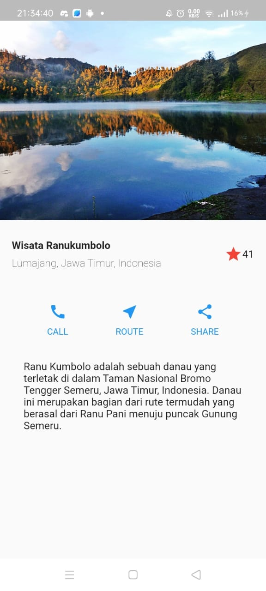

# Bagus Rezky Adhyaksa
# 2141720210

# Tugas 1
## Praktikum 1 TitleSection

Code
```dart
 Widget titleSection = Container(
      padding: const EdgeInsets.all(16.0),
      child: Row(
        children: [
          Expanded(
            /* soal 1*/
            child: Column(
              crossAxisAlignment: CrossAxisAlignment.start,
              children: [
                /* soal 2*/
                Container(
                  padding: const EdgeInsets.only(bottom: 8.0),
                  child: const Text(
                    'Wisata Ranukumbolo',
                    style: TextStyle(
                      fontWeight: FontWeight.bold,
                    ),
                  ),
                ),
                const Text(
                  'Lumajang, Jawa Timur, Indonesia',
                  style: TextStyle(fontWeight: FontWeight.w200),
                ),
              ],
            ),
          ),
          /* soal 3*/
          const Icon(
            Icons.star,
            color: Colors.red,
          ),
          const Text('41'),
        ],
      ),
    );
```
Output



## Praktikum 2 ButtonSection

Code Column _buildButtonColumn
```dart
    Column _buildButtonColumn(Color color, IconData icon, String label) {
      return Column(
        mainAxisSize: MainAxisSize.min,
        mainAxisAlignment: MainAxisAlignment.center,
        children: [
          Icon(icon, color: color),
          Container(
            margin: const EdgeInsets.only(top: 8),
            child: Text(
              label,
              style: TextStyle(
                fontSize: 12,
                fontWeight: FontWeight.w400,
                color: color,
              ),
            ),
          ),
        ],
      );
    }
```
Code widget buttonSection
```dart
    Widget buttonSection = Container(
      child: Row(
        mainAxisAlignment: MainAxisAlignment.spaceEvenly,
        children: [
          _buildButtonColumn(Colors.blue, Icons.call, 'CALL'),
          _buildButtonColumn(Colors.blue, Icons.near_me, 'ROUTE'),
          _buildButtonColumn(Colors.blue, Icons.share, 'SHARE'),
        ],
      ),
    );
```

Output


## Praktikum 3 TextSection

Code widget textSection
```dart
    Widget textSection = Container(
      padding: const EdgeInsets.all(32),
      child: const Text(
        'Ranu Kumbolo adalah sebuah danau yang terletak di dalam Taman Nasional Bromo Tengger Semeru, Jawa Timur, Indonesia. Danau ini merupakan bagian dari rute termudah yang berasal dari Ranu Pani menuju puncak Gunung Semeru.',
      ),
    );
```
Output


## Praktikum 4 ImageSection
Code widget imageSection
```dart
    Widget header() {
      return Padding(
        padding: const EdgeInsets.all(0),
        child: Column(
          children: [
            Center(
              child: Image.asset(
                'assets/rakum2.jpg',
                width: 360,
              ),
            ),
          ],
        ),
      );
    }
```
Output


## Tambahan
Code widget Scaffold
```dart
    return Scaffold(
      body: ListView(
        children: [
          header(),
          const SizedBox(height: 10),
          titleSection,
          const SizedBox(height: 30),
          buttonSection,
          textSection,
        ],
      ),
    );
```
Output Keseluruhan


# Tugas 2
