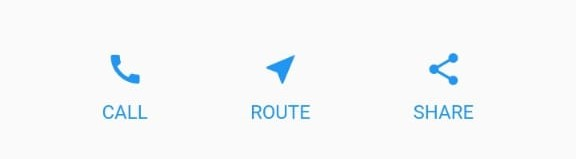
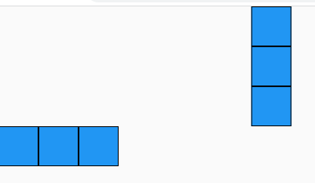
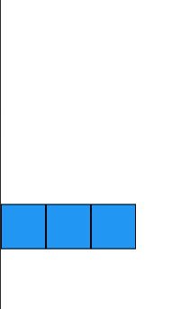
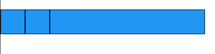
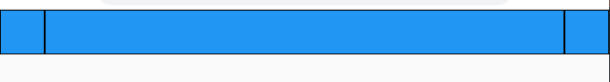
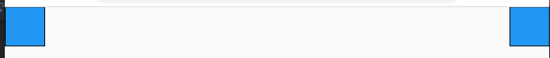
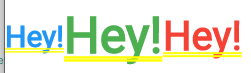
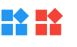
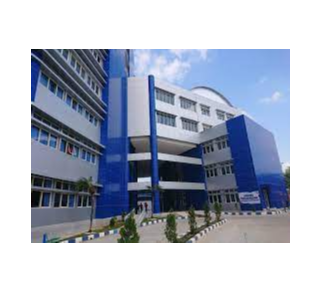
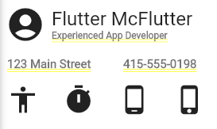

# Bagus Rezky Adhyaksa
# 2141720210

# Tugas 1
## Praktikum 1 TitleSection

Code
```dart
 Widget titleSection = Container(
      padding: const EdgeInsets.all(16.0),
      child: Row(
        children: [
          Expanded(
            /* soal 1*/
            child: Column(
              crossAxisAlignment: CrossAxisAlignment.start,
              children: [
                /* soal 2*/
                Container(
                  padding: const EdgeInsets.only(bottom: 8.0),
                  child: const Text(
                    'Wisata Ranukumbolo',
                    style: TextStyle(
                      fontWeight: FontWeight.bold,
                    ),
                  ),
                ),
                const Text(
                  'Lumajang, Jawa Timur, Indonesia',
                  style: TextStyle(fontWeight: FontWeight.w200),
                ),
              ],
            ),
          ),
          /* soal 3*/
          const Icon(
            Icons.star,
            color: Colors.red,
          ),
          const Text('41'),
        ],
      ),
    );
```
Output


## Praktikum 2 ButtonSection

Code Column _buildButtonColumn
```dart
    Column _buildButtonColumn(Color color, IconData icon, String label) {
      return Column(
        mainAxisSize: MainAxisSize.min,
        mainAxisAlignment: MainAxisAlignment.center,
        children: [
          Icon(icon, color: color),
          Container(
            margin: const EdgeInsets.only(top: 8),
            child: Text(
              label,
              style: TextStyle(
                fontSize: 12,
                fontWeight: FontWeight.w400,
                color: color,
              ),
            ),
          ),
        ],
      );
    }
```
Code widget buttonSection
```dart
    Widget buttonSection = Container(
      child: Row(
        mainAxisAlignment: MainAxisAlignment.spaceEvenly,
        children: [
          _buildButtonColumn(Colors.blue, Icons.call, 'CALL'),
          _buildButtonColumn(Colors.blue, Icons.near_me, 'ROUTE'),
          _buildButtonColumn(Colors.blue, Icons.share, 'SHARE'),
        ],
      ),
    );
```

Output


## Praktikum 3 TextSection

Code widget textSection
```dart
    Widget textSection = Container(
      padding: const EdgeInsets.all(32),
      child: const Text(
        'Ranu Kumbolo adalah sebuah danau yang terletak di dalam Taman Nasional Bromo Tengger Semeru, Jawa Timur, Indonesia. Danau ini merupakan bagian dari rute termudah yang berasal dari Ranu Pani menuju puncak Gunung Semeru.',
      ),
    );
```
Output


## Praktikum 4 ImageSection
Code widget imageSection
```dart
    Widget header() {
      return Padding(
        padding: const EdgeInsets.all(0),
        child: Column(
          children: [
            Center(
              child: Image.asset(
                'assets/rakum2.jpg',
                width: 360,
              ),
            ),
          ],
        ),
      );
    }
```
Output


## Tambahan
Code widget Scaffold
```dart
    return Scaffold(
      body: ListView(
        children: [
          header(),
          const SizedBox(height: 10),
          titleSection,
          const SizedBox(height: 30),
          buttonSection,
          textSection,
        ],
      ),
    );
```
Output Keseluruhan


# Tugas 2

## Row & Column
code
```dart
Widget atas = const Column(
      children: [
        BlueBox(),
        BlueBox(),
        BlueBox(),
      ],
    );

    Widget bawah = const Row(
      children: [
        BlueBox(),
        BlueBox(),
        BlueBox(),
      ],
    );

    return Scaffold(
      body: ListView(
        children: [
          atas,
          bawah,
        ],
      ),
    );
```
Output



## Flexible
code loose
```dart
return const Row(
      children: [
        BlueBox(),
        Flexible(
          fit: FlexFit.loose,
          flex: 1,
          child: BlueBox(),
        ),
```
Output



code tight
```dart
Flexible(
          fit: FlexFit.tight,
          flex: 1,
          child: BlueBox(),
        ),
```
Output



## Expanded
code
```dart
Widget build(BuildContext context) {
    Widget expanded = const Row(
      children: [
        BlueBox(),
        Expanded(
          child: BlueBox(),
        ),
        BlueBox(),
      ],
    );

    return Scaffold(
      body: ListView(
        children: [
          expanded,
        ],
      ),
    );
  }
```
Output



## Sized Box
code
```dart
Widget build(BuildContext context) {
    Widget sizebox = const Row(
      mainAxisSize: MainAxisSize.max,
      children: [
        BlueBox(),
        SizedBox(
          width: 400,
        ),
        BlueBox(),
      ],
    );

    return Scaffold(
      body: ListView(
        children: [
          sizebox,
        ],
      ),
    );
  }
```
Output


## Spacer
code
```dart
 Widget build(BuildContext context) {
    Widget spacer = const Row(
      mainAxisSize: MainAxisSize.max,
      children: [
        BlueBox(),
        Spacer(
          flex: 1,
        ),
        BlueBox(),
      ],
    );

    return Scaffold(
      body: ListView(
        children: [
          spacer,
        ],
      ),
    );
  }
```
Output



## Text Widget

Code

```dart
    return const Row(
      crossAxisAlignment: CrossAxisAlignment.center,
      textBaseline: TextBaseline.alphabetic,
      children: [
        Text(
          'Hey!',
          style: TextStyle(
            fontSize: 30,
            fontFamily: 'Futura',
            color: Colors.blue,
          ),
        ),
        Text(
          'Hey!',
          style: TextStyle(
            fontSize: 50,
            fontFamily: 'Futura',
            color: Colors.green,
          ),
        ),
        Text(
          'Hey!',
          style: TextStyle(
            fontSize: 40,
            fontFamily: 'Futura',
            color: Colors.red,
          ),
        ),
      ],
    );
```

Output



## Icon Widget

Code

```dart
return const Row(
      crossAxisAlignment: CrossAxisAlignment.center,
      textBaseline: TextBaseline.alphabetic,
      children: [
        Icon(
          Icons.widgets,
          size: 50,
          color: Colors.blue,
        ),
        Icon(
          Icons.widgets,
          size: 50,
          color: Colors.red,
        ),
      ],
    );
```

Output



## Image Widget

Code
```dart
return Row(
      mainAxisAlignment: MainAxisAlignment.center,
      children: [
        Image.network('www.polinema.ac.id'),
      ],
    );
```

Output



## All Widget

Code

```dart
return Column(
      mainAxisSize: MainAxisSize.min,
      crossAxisAlignment: CrossAxisAlignment.stretch,
      children: [
        Row(
          children: [
            const Padding(
              padding: EdgeInsets.all(8.0),
              child: Icon(Icons.account_circle, size: 50),
            ),
            Column(
              crossAxisAlignment: CrossAxisAlignment.start,
              mainAxisSize: MainAxisSize.min,
              children: [
                Text(
                  'Flutter McFlutter',
                  style: Theme.of(context).textTheme.headlineSmall,
                ),
                const Text(
                  'Experienced App Developer',
                  style: TextStyle(
                    fontSize: 12,
                    color: Colors.black54,
                  ),
                ),
              ],
            ),
          ],
        ),
        const SizedBox(height: 8),
        const Row(
          children: [
            SizedBox(width: 10),
            Text(
              '123 Main Street',
              style: TextStyle(fontSize: 15, color: Colors.black54),
            ),
            SizedBox(width: 40),
            Text(
              '415-555-0198',
              style: TextStyle(fontSize: 15, color: Colors.black54),
            ),
          ],
        ),
        const SizedBox(height: 16),
        const Row(
          mainAxisAlignment: MainAxisAlignment.start,
          children: [
            SizedBox(width: 10),
            Icon(Icons.accessibility, size: 40),
            SizedBox(width: 30),
            Icon(Icons.timer, size: 40),
            SizedBox(width: 30),
            Icon(Icons.phone_android, size: 40),
            SizedBox(width: 30),
            Icon(Icons.phone_iphone, size: 40),
          ],
        ),
      ],
    );
```

Output

