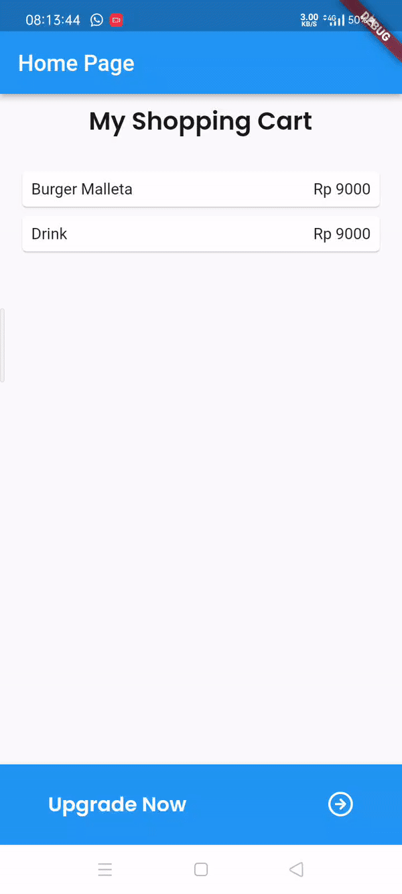

# week_8

Home Page

```dart
class HomePage extends StatelessWidget {
  HomePage({super.key});
  final List<Item> items = [
    Item(
      name: 'Burger Malleta',
      price: 9000,
      imageUrl: 'assets/burger.png',
      stock: 50,
      rating: 4.5,
    ),
    Item(
      name: 'Drink',
      price: 9000,
      imageUrl: 'assets/drink.png',
      stock: 50,
      rating: 4.5,
    ),
  ];
  final routeName = '/item';

  @override
  Widget build(BuildContext context) {
    return Scaffold(
      appBar: AppBar(
        title: const Text('Home Page'),
        backgroundColor: Colors.blue,
      ),
      body: Container(
        margin: const EdgeInsets.all(8),
        child: Column(
          children: [
            Center(
              child: Text(
                'My Shopping Cart',
                style: GoogleFonts.poppins(
                  fontSize: 22,
                  fontWeight: FontWeight.w600,
                  color: const Color(0xff191919),
                ),
              ),
            ),
            const SizedBox(
                height: 16), // Add some spacing between the text and ListView
            Expanded(
              child: ListView.builder(
                padding: const EdgeInsets.all(8),
                itemCount: items.length,
                itemBuilder: (context, index) {
                  final item = items[index];
                  return InkWell(
                    onTap: () =>
                        Navigator.pushNamed(context, '/item', arguments: item),
                    child: Card(
                      child: Container(
                        margin: const EdgeInsets.all(8),
                        child: Row(
                          children: [
                            Expanded(child: Text(item.name.toString())),
                            Expanded(
                              child: Text(
                                'Rp ${item.price.toString()}',
                                textAlign: TextAlign.end,
                              ),
                            ),
                          ],
                        ),
                      ),
                    ),
                  );
                },
              ),
            ),
          ],
        ),
      ),
      bottomNavigationBar: BottomNavigationBar(
        type: BottomNavigationBarType.fixed,
        backgroundColor: Colors.blue,
        items: <BottomNavigationBarItem>[
          BottomNavigationBarItem(
            icon: Padding(
              padding: const EdgeInsets.only(
                top: 15.0,
                left: 30,
              ),
              child: Text(
                'Upgrade Now',
                style: GoogleFonts.poppins(
                  fontSize: 18,
                  fontWeight: FontWeight.w600,
                  color: const Color(0xffFFFFFF),
                ),
              ),
            ),
            label: '',
          ),
          BottomNavigationBarItem(
            icon: Padding(
              padding: const EdgeInsets.only(top: 15.0, left: 70),
              child: Image.asset(
                'assets/rowIcon.png',
                width: 24,
              ),
            ),
            label: '',
          ),
        ],
      ),
    );
  }
}
```

Item Page

```dart
class ItemPage extends StatelessWidget {
  const ItemPage({super.key});
  @override
  Widget build(BuildContext context) {
    final itemArgs = ModalRoute.of(context)!.settings.arguments as Item;
    return Scaffold(
      appBar: AppBar(
        backgroundColor: Colors.blue,
        title: const Text('Item Page'),
      ),
      body: Container(
        margin: const EdgeInsets.all(15),
        child: Column(
          children: [
            Hero(
              tag: itemArgs.name,
              child: Image.asset(
                itemArgs.imageUrl,
                width: 500,
                height: 500,
              ),
            ),
            Container(
              padding: const EdgeInsets.all(16),
              decoration: BoxDecoration(
                borderRadius: BorderRadius.circular(20),
                color: Colors.blue,
              ),
              child: Column(
                crossAxisAlignment: CrossAxisAlignment.start,
                children: [
                  Text(itemArgs.name.toString(), style: boldTextStyle),
                  const SizedBox(height: 8),
                  Row(
                    children: [
                      Text(
                        'Stok: ',
                        style: buttonTextStyle,
                      ),
                      Text(
                        itemArgs.stock.toString(),
                        style: buttonTextStyle,
                      ),
                    ],
                  ),
                  const SizedBox(height: 8),
                  Row(
                    children: [
                      const Text(
                        'Rating: ',
                        style: TextStyle(
                            fontSize: 20,
                            fontWeight: FontWeight.bold,
                            color: Colors.white),
                      ),
                      const Icon(
                        Icons.star,
                        color: Colors.yellow, // Warna bintang kuning
                        size: 24,
                      ),
                      Text(
                        itemArgs.rating.toString(),
                        style: buttonTextStyle,
                      ),
                    ],
                  ),
                ],
              ),
            ),
          ],
        ),
      ),
    );
  }
}
```

Review


